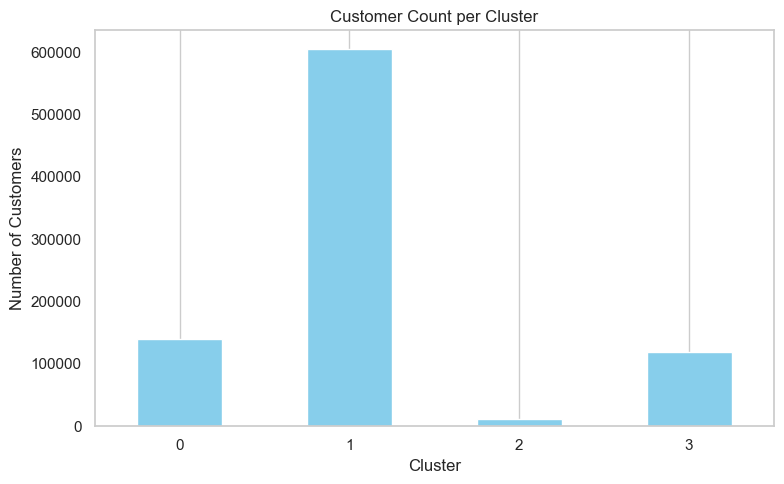

# 🏦 EDA Project and Customer Segmentation in Bank

  

## 📝 Overview

This project explores recent customer account data to segment clients into key groups. The goal is to help the bank improve targeting strategies and enhance risk assessment by identifying distinct customer profiles.

## 🗂️ Dataset

1,048,556 transaction records

9 raw variables → 15 engineered features after preprocessing

884,256 clean records used for modeling

## 🛠️ What I Did?

1. **Cleaned & explored**: Handled missing values, outliers, high-cardinality features

2. **Engineered features**: Created recency, frequency, monetary value (RFM), balance stability, transaction patterns, time-based variables

3. **Clustered**: Applied K-Means with Elbow Method + Silhouette Analysis to find optimal k=4

4. **Validated**: Used PCA for cluster visualization

  

  

## 🎯 Business Insights

Based on the K-Means segmentation with 4 clusters, the following strategies are recommended to tailor products, marketing, and risk management for each segment:

**Cluster 0 — Mainstream Low-Balance Customers**

- Focus on onboarding and reactivation initiatives. Recommend micro-savings accounts, simple banking products, and educational content on building financial security. 

- This segment shows high risk due to low balances and limited engagement.

**Cluster 1 — Mature Mid-Balance Customers**

- Prioritize engagement and cross-selling strategies. Offer retirement planning support, insurance products, and loyalty programs to encourage retention. 

- Risk is low to moderate, with steady balances.

**Cluster 2 — High-Balance, High-Variance Customers**

- Emphasize premium retention and proactive monitoring. Provide dedicated relationship management, wealth advisory services, and exclusive investment opportunities. 

- This group is low risk but requires close oversight due to large balance fluctuations.

**Cluster 3 — Mid-Balance but Volatile Customers**

- Drive growth and stabilization with targeted financial planning and risk-adjusted credit offers. Recommend flexible credit products, transaction monitoring tools, and incentives for consistent balances. 

- Risk is moderate, with potential for significant value capture.

  

